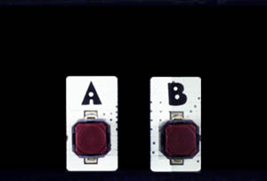

```template
\\
```


# Buttons

## Step 1 @unplugged

The BrainPad Pulse is equipped with two directional buttons (A and B) that we can program. In this tutorial we'll use the BrainPad buttons to turn on change images on the display. 



## Step 2 @unplugged

We use buttons every day to communicate with electronic devices all around us. Even the keyboard on your computer is made up of buttons. 


## Step 3 @fullscreen

To get started let's first drag the image of eyes looking straight ahead, into the ``||loops:onStart||`` block. The eyes block we need is found under DISPLAY on the side menu bar. Grab the ``||display:showImage||`` block. Then select the eyes image. 

 ```blocks
display.showImage(images.eyes1)
```

## Step 4 @fullscreen

Next let's add a block to detect when button A is pressed. We can find the block we need under INPUT. Grab the ``||input:on button||`` block. 

 ```blocks
input.buttonA.onEvent(ButtonEvent.Down, function () {
	
})
```

## Step 5 @fullscreen

Now let's drag in another ``||display:showImage||`` block and put it inside ``||input:on button||`` block. This time select the image with the eyes looking to the left. 

 ```blocks
input.buttonA.onEvent(ButtonEvent.Click, function () {
    display.showImage(images.eyes3)
})
```

## Step 5 @fullscreen

We've got button A doing something, now let's add button B. Inside the INPUT menu grab another ``||input:on button||`` block. This time we'll switch to use the 'B' button in the drop down of the block.

 ```blocks
input.buttonB.onEvent(ButtonEvent.Click, function () {
	
})
```

## Step 7 @fullscreen

Finally, we can add the eyes image looking to the left. Remember it was under the DISPLAY menu. Drag the ``||display:showImage||`` block and place it inside our``||input:on button B||`` block. Now try pressing the A & B buttons inside the simulator. Now your read to download to the BrainPad. 
 
 ```blocks
input.buttonB.onEvent(ButtonEvent.Click, function () {
    display.showImage(images.eyes4)
})
```
