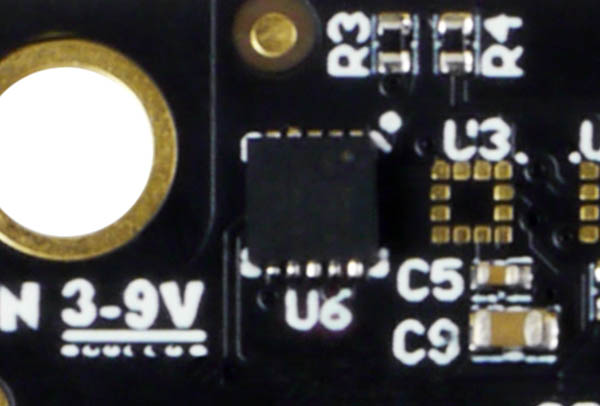
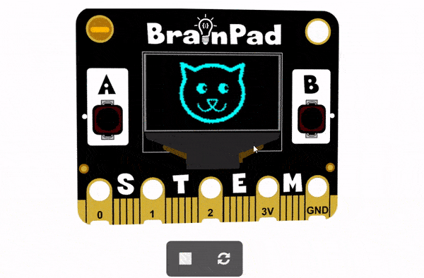

# Accelerometer

## Step 1 @unplugged

The accelerometer is an input device that measures the force of acceleration in three axes (x, y, and z). Commonly know as g-force. 



## Step 2 @unplugged

If the BrainPad is laying flat on a the table as shown, the x-axis runs horizontally left and right, the y-axis goes horizontally toward you and away from you, and the z-axis extends vertically straight up and down.


## Step 3 @fullscreen

Let's use a GRAPH to chart the values from the accelerometer. First, we need to grab the ``||display:graph||`` block and put it inside our ``||loops:forever||`` block

```blocks
forever(function () {
    display.graph(0)
})   
```

## Step 4 @fullscreen

Next, we need to grab the block that will read the values from our accelerometer and graph them onto the display. We can find this under the INPUT tab. You can also change which value the accelerometer is reading . 

```blocks
forever(function () {
    display.graph(input.acceleration(Dimension.X))
})
```

## Step 5 @fullscreen

Now you'll notice in the simulator we can move the BrainPad around with our mouse. Try tilting the BrainPad Up and watch the values on the graph change.


## Step 6 @fullscreen

Let's use the accelerometer inside an if-statement. Drag in an ``||logic:if-then||`` block into our forever loop. 

```blocks
forever(function () {
    if (true) {
    	
    }
})
```

## Step 7 @fullscreen

Next we'll need to add a comparison block to our ``||logic:if-then||`` block

```blocks
forever(function () {
    if (0 == 0) {
    	
    }
})
```

## Step 8 @fullscreen

Now let's read the value from the accelerometer's X value see if it's less than 500. Select X in the menu of the block we just added. 

```blocks
forever(function () {
    if (input.acceleration(Dimension.X) < 500) {
    	
    }
})
```

## Step 9 @fullscreen

Let's add an image and change it based on how we tilt the BrainPad. First drag one of the images looking to the right. We'll use the CAT looking LEFT.

```blocks
forever(function () {
    if (input.acceleration(Dimension.X) < 500) {
        display.showImage(images.cat1)
    }
})
```

## Step 10 @fullscreen

Finally click on the + sign inside the our ``||logic:if-then||`` block, here we'll add the image looking the other way. 

```blocks
forever(function () {
    if (input.acceleration(Dimension.X) < 500) {
        display.showImage(images.cat1)
    } else {
        display.showImage(images.cat2)
    }
})
```

## Step 11 @fullscreen

Now when you tilt the BrainPad in either direction the image will change. You can fine tune the values as you see fit.  



## Step 12 @fullscreen

Now that you know how to use the accelerometer trying playing around with the other parameters and see what the results are. When you're done deploy your program and see how it acts on the actual BrainPad. 

