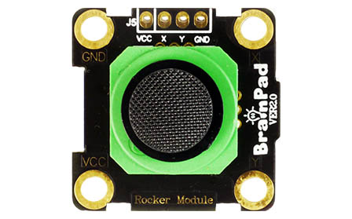
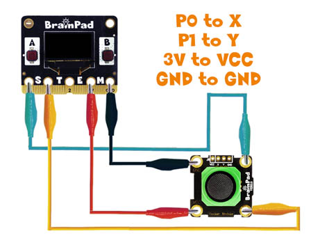
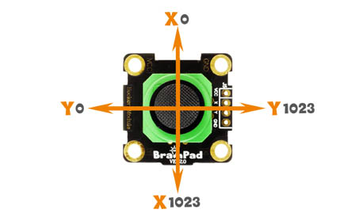

# Analog Read

## Step 1 @unplugged
This lesson uses the BrainClips kit. We're going to demonstrate how to read an analog value from the Rocker Module



## Step 2 @unplugged
Connect the alligator clips as shown in the diagram from the Pulse to the Module (P0 to X, P1 to Y, 3V to VCC, GND to GND).

 

## Step 3 @unplugged
While connecting the wires, you may have noticed we connected P0 to X and P1 to Y. The rocker returns both an X and Y signal. The values range from 0 to 1023 for both X & Y

 

## Step 4 @fullscreen
Let's display the values of X & Y on the screen when we move the rocker. We need for the BrainPad to constantly read the X and Y. So let's put ``||display:showNumber||`` block inside our ``||loops:forever||`` block 

```blocks
forever(function () {
    display.showNumber(0, 1)
})
```

## Step 5 @fullscreen
Finally we just need to grab the ``||pins:analog read||`` block it's found by clicking 'ADVANCED and then 'PINS' Drag it into the ``||display:showNumber||`` block. By default it's already reading P0. Transfer your project to the BrainPad Pulse. Move the joystick on the Rocker and let's see what happens. 

```blocks
forever(function () {
    display.showNumber(pins.P0.analogRead(), 1)
})

```

## Step 6 @unplugged
The values when we aren't touching the rocker are around 500 for X and 500 Y. We could tell our program not to do anything when the Rocker is in this range. 


## Step 7 @unplugged
You'll also notice it's never exactly one number. This is the nature of an analog signal and the sensitivity of the Rocker. We have to adjust our code for this sensitivity. Code we create would have to read an acceptable range, say between 450 & 550 to tell us when the Rocker isn't moving.

