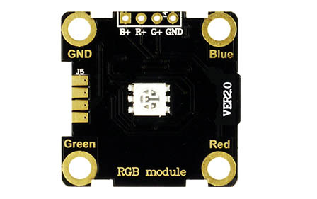
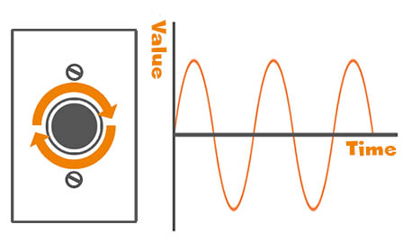
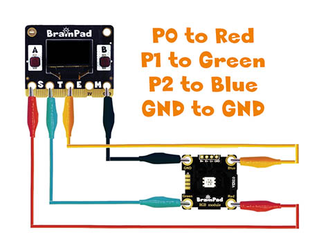
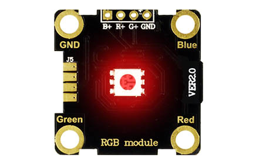

# Analog Write

## Step 1 @unplugged
This lesson uses the BrainClips kit. Analog clips can either read or write. Some BrainClip modules can do both, like the RGB LED. In this lesson we'll cover analog write using the RGB module.



## Step 2 @unplugged
Analog signals, unlike digital signals, has a continuous electrical signal, that can change value over time. A dimmer switch which adjusts the level of a light is an example of how an analog signal works. The switch itself isn't analog but what it demonstrates is. 



## Step 3 @unplugged
We're going to use the same RGB module we did in the digital write tutorial. This time rather than turn each of the LEDS inside ON or OFF, we will adjust the RED, GREEN, and BLUE values to make different colors. Just like we did in digital write. Connect the alligator clips as shown in the diagram from the Pulse to the module (P0 to RED, P1 to GREEN, P2 to BLUE, GND to GND).

 

## Step 5 @fullscreen
Now we're ready to start building our code blocks. Under the ADVANCED tab click on PINS and select the ``||pins:analog write||`` block. You'll notice the ``||pins:analog write||`` blocks can hold a value between 0 to 1023. With 0 being OFF to 1023 being fully ON. Try changing the value and downloading to the BrainPad Pulse to see the results.  

 ```blocks
pins.P0.analogWrite(1023)
```

## Step 6 @unplugged
You may have noticed that changing the value in the block changes the level of intensity of the RED led  



## Step 7 @fullscreen
Drag in two more of the ``||pins:analog write||`` blocks and change pins to P1 and P2 in the new blocks. Try changing the values inside the blocks and download to the BrainPad to see what kind of colors you can create. The number of possible colors is 1024 to power of 3 or 1,073,741,824 different possible colors. Many of these might look similar but all would be slightly different.

 ```blocks
pins.P0.analogWrite(800)
pins.P0.analogWrite(50)
pins.P0.analogWrite(300)
```

## Step 8 @unplugged
What colors were you able to create? We now have a better understanding of how many LEDS put together can make images like an LED TV or giant LED billboards.

