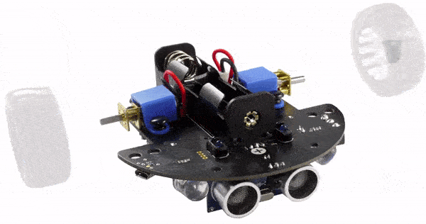
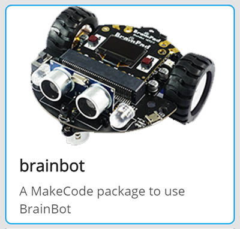
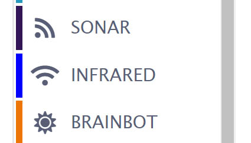
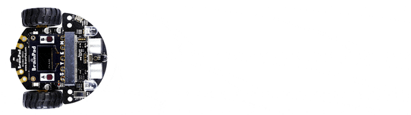
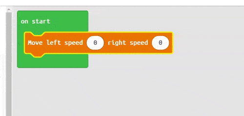
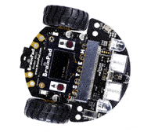
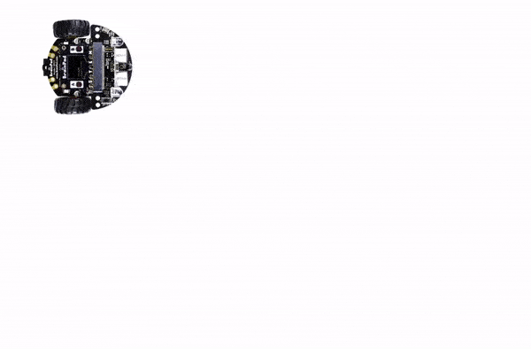
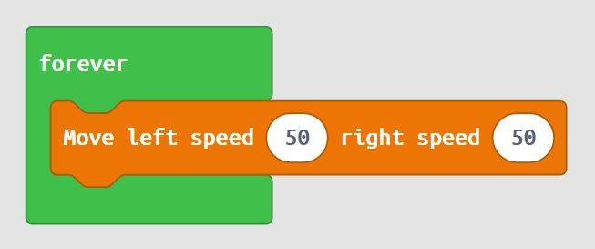
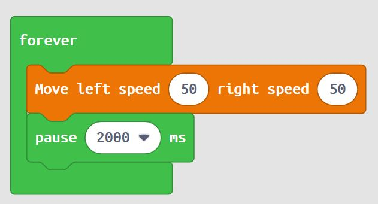
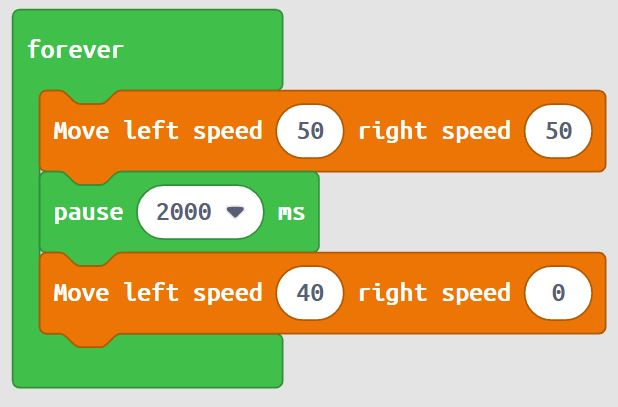

# Moving the BrainBot

## Step 1 @unplugged

This tutorial assumes you've assembled your BrainBot and are ready to program. If you haven't please visit the assembly page. 

[BrainBot Assembly Page](https://www.brainpad.com/lessons/brainbot-assembly/)

## Step 2 @fullscreen

The BrainBot requires some extra blocks not found when we first start MakeCode. We need to add these blocks to MakeCode by importing an Extension. Under the 'Advanced' tab on the side menu at the very bottom click on 'Extensions' at the very bottom. Click on BrainBot to load the extension. 

## Step 3 @unplugged

If you look on the menu 3 new sections have been added. Sonar, Infrared, and BrainBot.

## Step 4 @unplugged

Let's make the robot move forward. Click on ``||Brainbot:BrainBot||`` and drag in the ``||Brainbot:Move left & right||`` block into the ``||loops:on start||`` block. The block has two parameter one for each motors speed. 

## Step 5 @fullscreen

To move the robot forward we change both parameters in ``||Brainbot:Move left speed & right speed||`` block to the same positive number. To move backwards you would make both parameters the same negative number. Download it the BrainPad to see what happens. 

## Step 6 @fullscreen

We can make the BrainBot spin in place by setting both parameters to opposite values. Set the first number to -100 and the second number to 100.
Try this and Download to the Brainpad. 

## Step 7 @unplugged

Finally let's make the BrainBot drive around in a larger circle. To do this we'll add a couple move blocks and some pauses. 

## Step 8 @fullscreen

First drag the ``||Brainbot:Move left speed & right speed||`` block into the ``||loops:forever||`` block. Set both parameters to 50. This will make the BrainBot move forward at 1/2 speed. 

## Step 9 @fullscreen

Next drag the ``||loops:pause||`` block into the ``||loops:forever||`` block just below the ``||Brainbot:Move left speed & right speed||`` block. Set the pause to 2 seconds or 2000ms. We're going to use the ``||loops:forever||`` block so the code will keep repeating. 

## Step 10 @fullscreen

Next drag another ``||Brainbot:Move left speed & right speed||`` block just below our pause. This time we want make the BrainBot turn. So we'll set one of the parameters to 40 and the other to 0. Depending on which direction you want to turn decides which one is 40 and which is 0. 

## Step 11 @fullscreen

Finally drag the ``||loops:pause||`` block into the ``||loops:forever||`` block just below the last block we added. This time we'll set the pause to just 45ms. So our BrainBot will only turn for a short time, and then go back to moving straight. Download to the BrainPad

## Step 12 @unplugged

We've got the BrainBot dancing around now! Try playing around with different values in the ``||Brainbot:Move left speed & right speed||`` block and different ``||loops:pause||`` durations to see what kind of BrainBot driving patterns you can create. 

 