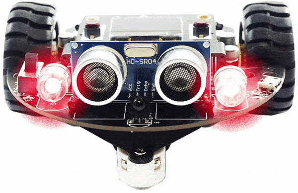
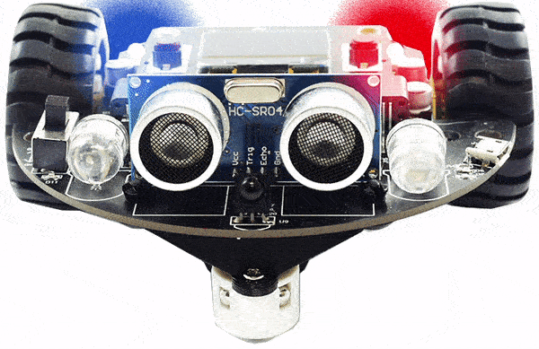

```template
\\
```

# BrainBot Lights

## Step 1 @unplugged

In this tutorial we'll make use of the BrainBot lights. 



## Step 2 @fullscreen

We need to add the BrainBot extension. Under the 'Advanced' tab on the side menu at the very bottom click on 'Extensions' at the very bottom. Click on BrainBot to load the extension. 


## Step 3 @unplugged

The BrainBot has two independent tailights. 




