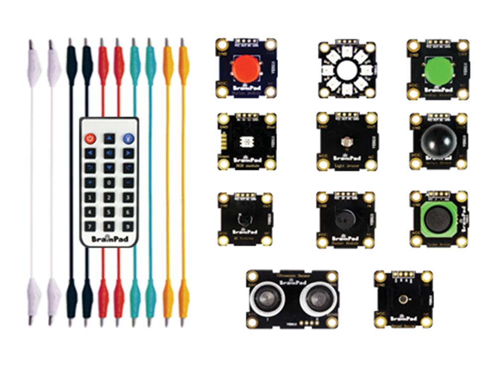
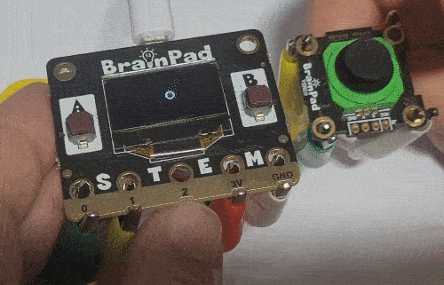

# BrainClip Kit

## Step 1 @unplugged
The lessons in this section use modules found in the BrainPad BrainClip kit. You'll be using alligator clips in the kit to connect each module to the BrainPad. One thing to keep in mind when using the MakeCode Simulator, you'll need to download your project to the hardware to see the final result. 

## Step 2 @unplugged
Most of the modules themselves fall into one of two different categories Digital modules and Analog modules. We'll discuss the difference inside each tutorial. 

## Step 3 @unplugged
Now that you know what's in the kit and what to expect, it's time to continue on through the rest of the Circuit tutorials. 

