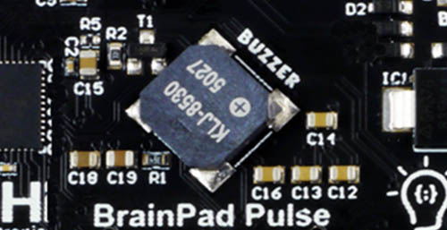

```template
//
```


# Buzzer Song

## Step 1 @unplugged

The BrainPad is equipped with an onboard buzzer that is capable of playing many different sounds. It can even be programmed to play a song. We will use it to make a simple 5 note melody, that's out of this world!
 



## Step 2 @fullscreen

Let's drag our first note into the ``||loops:on Start||`` block. Grab the ``||music:play tone||`` block. You'll find it under the ``||music:music||`` menu. 

```blocks
music.playTone(262, music.beat(BeatFraction.Half))
```

## Step 3 @fullscreen
 
Change the parameters of the note, by clicking on the value inside the ``||music:play tone||`` block. Change it by either entering a new number or playing a note on the virtual piano keyboard. We will change the value to 392(Middle G). We can leave the beat at 1.

```blocks
music.playTone(392, music.beat(BeatFraction.Whole))
```

## Step 4 @fullscreen

Now let's add more notes to our song. Drag another ``||music:play tone||`` block into the ``||loops:on start||`` block. This 2nd note in our song we'll set to 440(Middle A) and the beat to 1.
 
```blocks
music.playTone(392, music.beat(BeatFraction.Whole))
music.playTone(440, music.beat(BeatFraction.Whole))
```

## Step 5 @fullscreen
 
It's still not quite a melody, we need to add more notes. Just below the last ``||music:play tone||`` block, drag another ``||music:play tone||`` block in. This one we'll set to 349(Middle F) and the beat to 1/2 this time.

```blocks
music.playTone(392, music.beat(BeatFraction.Whole))
music.playTone(440, music.beat(BeatFraction.Whole))
music.playTone(349, music.beat(BeatFraction.Half))
```

## Step 6 @fullscreen
 
We still have more notes to add drag another ``||music:play tone||`` block in. Set it to 175(Low F), set the beat to 1/2 too.

```blocks
music.playTone(392, music.beat(BeatFraction.Whole))
music.playTone(440, music.beat(BeatFraction.Whole))
music.playTone(349, music.beat(BeatFraction.Half))
music.playTone(175, music.beat(BeatFraction.Half))
```

## Step 7 @fullscreen
 
Finally we will add one last note to our song. Drag one more ``||music:play tone||`` block in. Set it to 262(Middle C), set the beat to 2. See if you can find someone that recognizes the melody, like a parent or teacher.

```blocks
music.playTone(392, music.beat(BeatFraction.Whole))
music.playTone(440, music.beat(BeatFraction.Whole))
music.playTone(349, music.beat(BeatFraction.Half))
music.playTone(175, music.beat(BeatFraction.Half))
music.playTone(262, music.beat(BeatFraction.Double))
```

