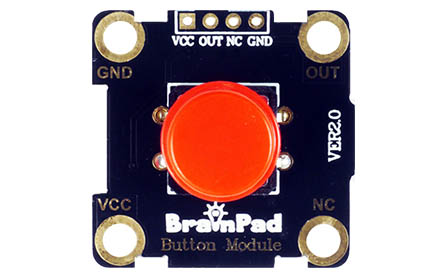
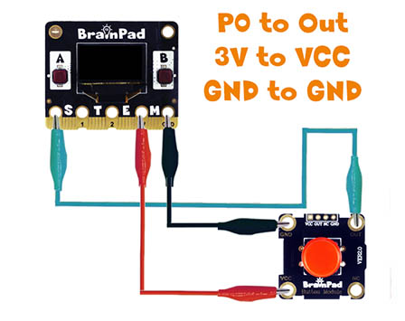

# Digital Read

## Step 1 @unplugged
This lesson uses the BrainClips kit. Remember that a digital signal is either ON or OFF. When reading a digital signal the value we read is also either ON or OFF, this is represented by 1 or 0, HIGH or LOW. In this tutorial we'll read the digital signal of an external button to turn on/off the Pulse's on-board LED.




## Step 2 @unplugged
Connect the alligator clips as shown in the diagram from the Pulse to the Module (P0 to OUT, 3V to VCC, GND to GND).

 


## Step 3 @fullscreen
Under the ADVANCED tab click on PINS and drag the ``||pins:on pin||`` event block into the work area. You can see this is a block is similar in shape to the ``||loops:on start||`` & ``||loops:forever||`` that holds other blocks. We call this type of block an event block. When the event is triggered the code inside this block will run. Keep the pin P0, but set the value to trigger to 'high'

```blocks
pins.P0.onEvent(PinEvent.Rise, function () {
	
})
```

## Step 4 @fullscreen
Now we just need to add one more block inside and our code and it will be complete. Under LED drag the ``||pins:led toggle||`` block into the event block we created. 

```blocks
pins.P0.onEvent(PinEvent.Fall, function () {
    led.toggle()
})
```

## Step 5 @unplugged
Now that we understand how the ``||pins:on pin||`` event block works let's drag in another one and set this one to 'pulse high'. Remove the ``||pins:led toggle||`` block. Let's use the screen to change the image. Under 'DISPLAY' drag the ``||display:show image||`` block into one of the ``||pins:on pin||`` event block and change it to the STOP image, and another ``||display:show image||`` and drag in the GO image. 

 ```blocks
pins.P0.onEvent(PinEvent.Fall, function () {
    display.showImage(images.stop)
})
pins.P0.onEvent(PinEvent.Rise, function () {
    display.showImage(images.go)
})
```

## Step 6 @unplugged
With this tutorial you can see how buttons are connected to a brain. Try changing what's inside the ``||pins:on pin||`` event block to something else. Maybe a song? You decide. 