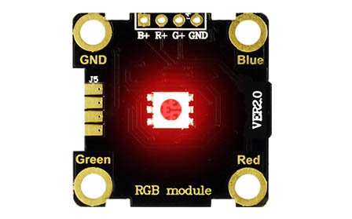

```template
//
```


# Digital Write

## Step 1 @unplugged
Digital clips can either read or write. A button is an example of a module that we would read, while an LED would be an example of a module we would write to. In this lesson we'll cover digital write.


## Step 2 @unplugged
Digital signals can only be one of two states, ON or OFF, 1 or 0, HIGH or LOW. An example would be like a regular light switch. We can either turn it ON or OFF. We achieve this same results on a circuit by setting pins HIGH or LOW. 


## Step 3 @unplugged
Let's use the RGB module found inside the kit. The RGB LED has 3 different color LEDs inside it. RED, GREEN, and BLUE. You'll notice each corner of the module has a hole we'll use these holes to connect the alligator clips found inside the kit to the BrainPad Pulse 


## Step 4 @unplugged
Connect the alligator clips as shown in the diagram from the Pulse to the Module.

 

## Step 5 @fullscreen
Now we're ready to start building our code blocks. Under ``||pins:PINS||`` grab the ``||pins:digital write||`` block and drag it into the ``||loops:on start||`` block. Set the pin HIGH by click the switch inside the block. Let's download what we have to the BrainPad and see what happens. Can you guess what will happen?

 ```blocks
pins.P0.digitalWrite(true)
```

## Step 6 @unplugged
If you said the LED would turn RED then you guessed correctly. We sent a Digital signal out of P0 to the RED hole of the module and set it HIGH or ON. 



## Step 7 @unplugged
Drag in two more of the ``||pins:digital write||`` blocks and change pins to P1 and P2 in the new blocks. Set P0 and P2 to LOW, and P1 to HIGH. Download to the BrainPad. By now you should know what the result will be. 

 ```blocks
pins.P0.digitalWrite(false)
pins.P1.digitalWrite(true)
pins.P2.digitalWrite(false)
```

## Step 8 @fullscreen
What do you think will happen if we set all the PINS HIGH? Change your blocks and download to the Pulse.  

```blocks
pins.P0.digitalWrite(true)
pins.P1.digitalWrite(true)
pins.P2.digitalWrite(true)
```

## Step 9 @fullscreen
If you look at the RGB LED you can see all three of the LEDS are illuminated. Since we're using Digital signal it is either fully ON or OFF, the A nalog write lesson we'll use the same module to show how many different colors can be generated by adjusting the intensity of each LED individually.   

```blocks
pins.P0.digitalWrite(true)
pins.P1.digitalWrite(true)
pins.P2.digitalWrite(true)
```

