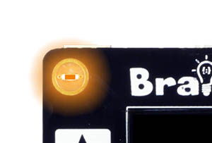

```template
forever(function () {
	
})

```


# Onboard LED

## Step 1 @unplugged

Let's start by doing something simple. Let's light up the LED on the BrainPad.



## Step 2 @unplugged

You'll notice the project begins with a ``||loops:forever||`` block. Anything we place inside this block will keep running forever in the program.

 ```blocks
forever(function () {
   
})
```

## Step 3 @fullscreen

Let's drag a new block into the ``||loops:forever||`` block. In our block menu under LED grab the ``||led:set led to||`` block and drag it into the ``||loops:forever||`` block switch from OFF to ON.  You'll see the LED in the simulator is now on. 

 ```blocks
forever(function () {
    led.setled(true)
})
```

## Step 4 @fullscreen

Let's make it blink! To make it blink we first need to add a pause. We can find the ``||loops:pause||`` block under the LOOPS menu. Drag the ``||loops:pause||`` block under the ``||led:set led to||`` block. Change the value inside the ``||loops:pause||`` block to 1 second or 1000ms. 

 ```blocks
forever(function () {
    led.setled(true)
    pause(1000)
})
```

## Step 5 @fullscreen

Next you need to another ``||led:set led to||`` block just below the ``||loops:pause||`` block. Set this one to OFF.

 ```blocks
forever(function () {
    led.setled(true)
    pause(1000)
    led.setled(false)
})
```

## Step6 @fullscreen

The LED doesn't quite blink properly yet, we need to add one last ``||loops:pause||`` block just below last ``||led:set led to||`` block and set the pause to 1 second or 1000ms. Congratulations!! Now you have a properly blinking LED. 

 ```blocks
forever(function () {
    led.setled(true)
    pause(1000)
    led.setled(false)
    pause(1000)
})
```
