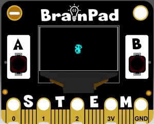

```template
controller.A.onEvent(ControllerButtonEvent.Pressed, function () {

})
scene.setBackgroundColor(9)
let mySprite = sprites.create(img`
    . . . . . . . .
    . . . . . . . .
    . . . . . . . .
    . . . . . . . .
    . . . . . . . .
    . . . . . . . .
    . . . . . . . .
    . . . . . . . .

    `, SpriteKind.Player)
game.onUpdateInterval(1000, function () {

})
```

# Moving Sprites

## Step 1 @unplugged

We've got our sprite animated, now let's use the buttons to control it and make our player jump. 




