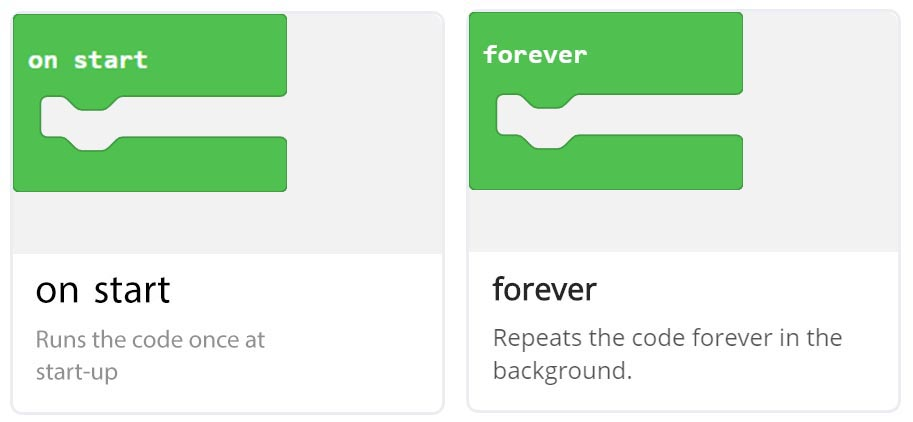
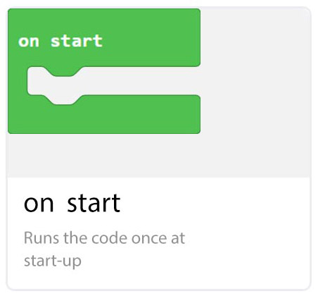
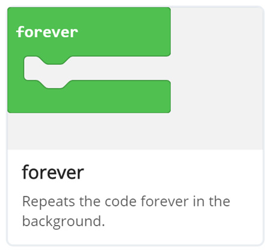

# On Start vs Forever Blocks

## Step 1 @unplugged

In this tutorial we explain the difference between the ``||loops:on start||`` and ``||loops:forever||`` blocks. We will also demonstrate how each works by blinking the on-board LED.



## Step 2 @unplugged

The ``||loops:on start||`` block runs when the BrainPad is first powered up. Any code placed inside the ``||loops:on start||`` block runs only once, at the beginning of your program. 




## Step 3 @fullscreen

To demonstrate how the ``||loops:on start||`` block works. Start by dragging in the ``||led:set led to||`` block into the ``||loops:on Start||`` block select ON

 ```blocks
led.setled(true)
```

## Step 4 @fullscreen

Next we will add the ``||loops:pause||`` block found under LOOPS. Follow this with  an ``||led:led off||`` block into the ``||loops:on start||`` block. Just below the first ``||led:led on||`` block we just added. Change the pause duration to 500 ms/half a second. 
 
 ```blocks
led.setled(true)
pause(500)
led.setled(false)
```

## Step 5 @fullscreen

The LED turns ON then OFF after just 1/2 a second. If you missed it, refresh the simulator and note the LED's change. 


## Step 6 @unplugged

The ``||loops:forever||`` block is different then the ``||loops:on start||`` block, the code inside the ``||loops:forever||`` block runs forever. Once the last block inside your ``||loops:forever||`` block is executed, the program will go back to the first block inside the ``||loops:forever||`` block and start again, forever. 



## Step 7 @fullscreen

Next will put the exact same blocks inside the ``||loops:forever||`` block. We will add another ``||loops:pause||`` block to the end,  to determine how long the LED remains off. Before looping back to the beginning of the forever block. 

 ```blocks
forever(function () {
    led.setled(true)
    pause(500)
    led.setled(false)
    pause(500)
})
``` 

## Step 8 @fullscreen
The ``||loops:on start||`` block runs first. Immediately followed by the ``||loops:forever||`` block, which continues to blink the LED, until we turn off the device. 


## Step 9 @fullscreen

These two very useful blocks serve an important purpose when programming embedded devices. We can use the ``||loops:on start||`` block to set up things in our program on startup. The part of the program we want to run continuously goes inside the ``||loops:forever||`` block, and loops as long as the device is on. 

