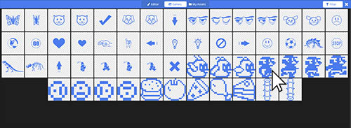

```template
\\
```

# Creating Sprites

## Step 1 @unplugged

We're going to create a Jumper Game and we'll need 'sprites' to do it. A 'sprite' is a 2-dimensional image that we use in games. A player's character would be a good example of a sprite. So would the things they have to avoid.  


## Step 2 @fullscreen

Click on 'Advanced'. Select ``||sprites:Sprites||``. Grab the ``||sprites:set mySprite||`` block and drag it into the ``||loops:on start||``. Let's create a variable name. In the block click on the 'mySprite' drop down and select 'New variable...'. Let's name our variable 'Jumper' since that's the game we'll be creating. We can keep the type of sprite set to 'player'


```blocks
enum SpriteKind {
    Player,
    Enemy
}
let Jumper: Sprite = null
Jumper = sprites.create(img`
. . . . . . . . . . . . . . . . 
. . . . . . . . . . . . . . . . 
. . . . . . . . . . . . . . . . 
. . . . . . . . . . . . . . . . 
. . . . . . . . . . . . . . . . 
. . . . . . . . . . . . . . . . 
. . . . . . . . . . . . . . . . 
. . . . . . . . . . . . . . . . 
. . . . . . . . . . . . . . . . 
. . . . . . . . . . . . . . . . 
. . . . . . . . . . . . . . . . 
. . . . . . . . . . . . . . . . 
. . . . . . . . . . . . . . . . 
. . . . . . . . . . . . . . . . 
. . . . . . . . . . . . . . . . 
. . . . . . . . . . . . . . . . 
`, SpriteKind.Player)

```

## Step 3 @fullscreen

Click inside the Grey empty space inside the block we just added. The sprite editor will pop up. Click on the 'LightBulb' Hint to see the names of the areas within the sprite editor. You can draw in any color but all colors will display as white since the Pulse screen is only Black and White. 

 

## Step 4 @fullscreen

For our game we'll use one of the built-in sprites. To find the built-in sprites click on 'Gallery' at the top of the sprite editor. Find the first Jumper image in the Gallery and select it.
 


## Step 5 @unplugged

We have a player! Download it to the Pulse to see the character we added on the screen 
 In the next tutorial we'll teach him how to walk by animating our sprite. Any sprite you create can be animated. 

 
