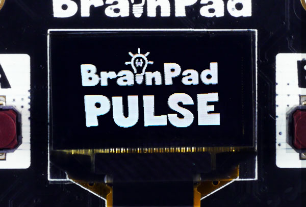
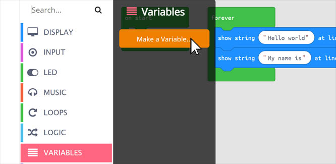

# Text

## Step 1 @unplugged

You can display lots of things on the BrainPad Pulse's display. One useful thing is displaying text. We'll create a string variable and display it on screen then change the variable when we press the buttons. 



## Step 2 @unplugged

To put text on the screen we can find first block we need found under DISPLAY on the side menu. Grab the ``||display:show string||`` block. This will display "Hello World" on the very first row. The BrainPad Pulse can display up to 6 rows of text. We can also center any text by adding extra spaces until it looks the way we want on the simulator. 

```blocks
forever(function () {
    display.showString("Hello world", 1)
})
```

## Step 3 @unplugged

Let's add a second ``||display:show string||`` block. This time let's change the words inside the block to say "My name is" on the 2nd line.

```blocks
forever(function () {
    display.showString("Hello world", 1)
    display.showString("My Name is", 2)
})
```

## Step 4 @unplugged

Now let's make a variable to hold our name, we'll later use this variable to switch between our first and last name. Under VARIABLES click 'Make a Variable'



## Step 5 @unplugged

Name our new variable 'My Name' and drag the newly created block into ``||loops:on start||`` block of our project. Don't worry about the value of the variable yet. We'll set that in the next step.

```blocks
let My_Name = 0
My_Name = 0
```

